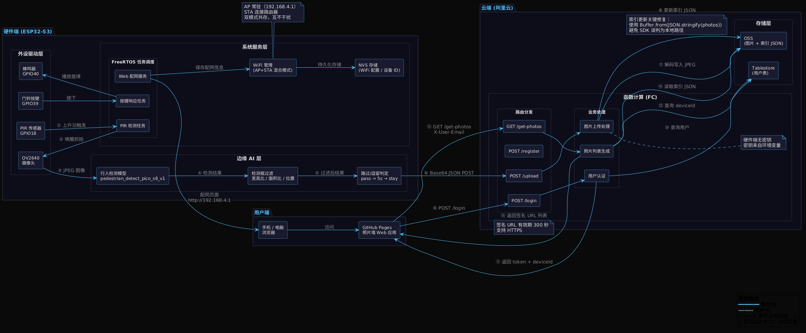
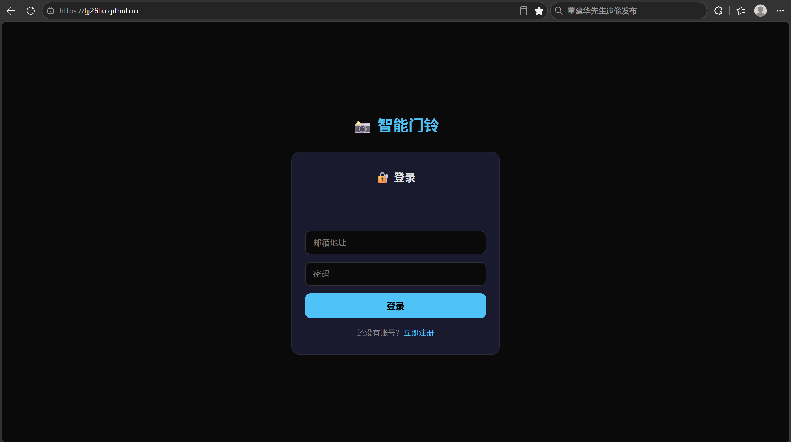
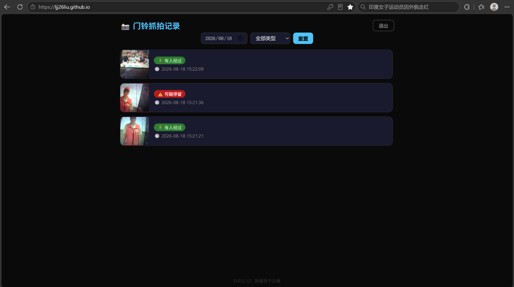
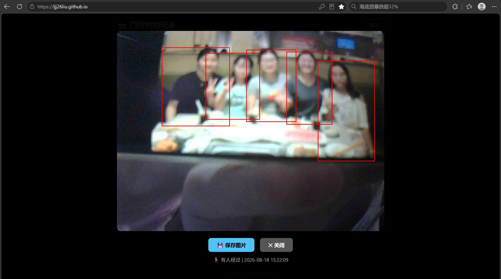

# 🔔 智能门铃系统

> 端云一体智能门铃 · 毕业设计作品 · ESP32-S3 + 边缘 AI + 阿里云 FC

[](https://github.com/espressif/esp-idf)
[](https://nodejs.org/)

---

## 📖 项目简介

本项目是一个**端云一体智能门铃系统**，覆盖从硬件端到云端的完整链路：

- **硬件端**：ESP32-S3 + PIR 传感器 + OV2640 摄像头，边缘 AI 人形检测
- **云端**：阿里云 FC（函数计算）+ OSS（图片存储）+ Tablestore（用户数据库）
- **前端**：GitHub Pages 托管的照片墙 Web 应用

> 🔒 **安全亮点**：OSS 密钥存储在 FC 环境变量中，固件无任何敏感信息。

---

## 🏗️ 系统架构




---

## 🛠️ 技术栈

| 层级 | 技术 |
|:-----:|------|
| **硬件端** | ESP32-S3 · ESP-IDF · FreeRTOS · esp-dl |
| **云端** | 阿里云 FC · Node.js 18 · OSS · Tablestore |
| **前端** | HTML5 · CSS3 · JavaScript (ES6+) · GitHub Pages |

---

## 📂 项目结构

```text
smart-doorbell/
├── firmware/           # ESP32-S3 固件 → 详见 firmware/README.md
├── cloud/              # 阿里云 FC 云函数 → 详见 cloud/README.md
├── frontend/           # 照片墙 Web 应用 → 详见 frontend/README.md
├── hardware/           # 硬件接线与外设清单 → 详见 hardware/README.md
├── images/             # 文档图片资源
├── docs/               # 项目文档
└── README.md           # 项目总览（本文档）
```

## 🚀 快速开始

### 硬件端

```bash
cd firmware
idf.py set-target esp32s3
idf.py build
idf.py -p /dev/ttyUSB0 flash
```

### 云端

1. 创建 FC 函数，配置环境变量

2. 部署 `cloud/index.js`

3. 配置 HTTP 触发器

### 前端

1. 将 `frontend/index.html` 推送到 GitHub 仓库

2. 启用 GitHub Pages

> 📌 详细部署步骤请参考各子目录的 README 文档。

## 🔌 硬件接线概览

|外设	|引脚|	说明|
|-------|-----|-----|
|OV2640 摄像头|	GPIO3-17, 21	|详见 camera_driver.h|
|PIR 传感器|	GPIO18	|高电平触发|
|门铃按键|	GPIO39	|低电平按下|
|蜂鸣器|	GPIO40	|PWM 驱动|

> 详细接线说明请参考：hardware/README.md

## 📷 展示

|登录页|	照片墙|	大图预览|	硬件实物|
|-----|-------|-------|---------|
|  |  |  |  |

## 📄 版权声明

Copyright (c) 2026 林佳佳

本作品为毕业设计项目，仅供展示和学习参考。未经作者明确书面许可，不得复制、修改、分发或用于商业用途。

## 🔗 各模块文档

|模块	|路径	|说明|
|-----|-----|----|
|硬件端固件	| [硬件端固件](./firmware/README.md)	|ESP32-S3 固件说明、编译烧录、功能说明|
|云函数后端	| [云函数后端](./cloud/README.md)	|FC 部署、API 接口文档、环境变量配置|
|前端应用	| [前端应用](./frontend/README.md)	|网页端功能、部署指南|
|硬件设计	| [硬件设计](./hardware/README.md)	|外设清单、GPIO 接线表|

## 📧 联系方式

- **作者**：林佳佳

- **邮箱**：362039836@qq.com

- **GitHub**：LJJ26liu
